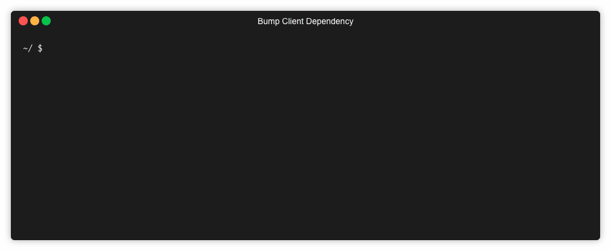

# Bump Client Dependency


[](https://app.fossa.io/projects/git%2Bgithub.com%2FSteveEdson%2Fbump-client-dependency?ref=badge_shield)

A simple script to increase the version number in `ClientDependency.config` files, commonly found in Umbraco CMS projects.

## Usage

You can either install this locally using:

```bash
npm install -g bump-client-dependency
```

This will then allow you to run the following:

```bash
$ bump-client-dependency
$ bump-cd
$ bcd
```

Alternatively, you can use `npx`:

```bash
$ npx bump-client-dependency
```

This will install the latest version, execute it, and then remove it. Ideal for keeping up to date with the latest.

## Using in CI builds

You can run:

```bash
$ npx bump-client-dependency -t
```

Instead of incrementing the version number by 1, it will be updated to the current timestamp.

## License
[](https://app.fossa.io/projects/git%2Bgithub.com%2FSteveEdson%2Fbump-client-dependency?ref=badge_large)